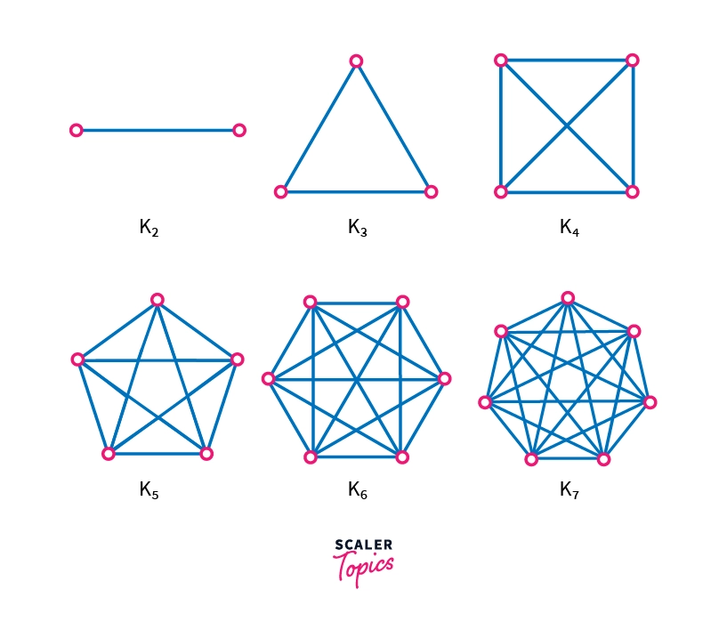

<!-- _color: white -->

# <!-- fit --> React JS

---

# Introduction

- Framework for building user interfaces (UIs)
- Technically not a library, as it also controls the flow of the application
- Build isolated UI components that **react** accordingly to the state of your application as it changes
  - hence, React is a 'declarative' framework -> you declare the expected result and logic, and React will deal with how we transition to that result/state.
- Saves a lot of effort programming for transitions between each state.
- Allows us to define each state nicely with JSX

---



---

# JSX (JS XML)

> JavaScript Extension Syntax → allows you to write and render HTML in JS

```jsx
const jsx = <h1>This is JSX</h1>;
```

**Note:** All JSX code must be encapsulated within a SINGLE parent.

```jsx
const jsx = (
  <div>
    <p></p>
    <p></p>
  </div>
);
```

```jsx
const jsx = (   // ❌
    <p></p>
    <p></p>
);
```

---

## React Components

Using functional components is now the norm. Class components are old.

```jsx
//  this is an object   ⤵
const MyComponent = (props) => {
  return <div>Hello {props.text}</div>;
};
```

### Using components

```jsx
//  App.js
const App = () => {
  return <MyComponent text={'World'} />; // becomes: <div>Hello World</div>
};
```

---

## React Components & Props

To use JavaScript code in your JSX HTML, use `{}` to encapsulate it:

```jsx
import React from 'react';
// We prefer this method of passing props⤵
const ExampleComponent = ({ name, age, zid }) => {
  return (
    <div>
      <p>Date: {new Date().toDateString()}</p>
      <h1>Hi! I'm {name}</h1>
      <h3>I'm {age} years old</h3>
      <h3>In 12 years time, I will be {age + 12} years old</h3>
      <h3>My zID is: {zid}</h3>
    </div>
  );
};
export default ExampleComponent;
```

---

## JSX self-closing tags

All tags in JSX must be closed. Tags like `<br>` and `<hr>` cannot be standalone
and must be `<br />` and `<hr />`.

Same goes for any components you make that don't have children: `<MyComponent />`

---

## React Hooks

> → simple JS functions that allow the reusability of functional components
> → they can track **the state** of the component and manage any **side-effects**

---

### `useState()`

The `useState` hook replaces the need for a `state` object that was used in
class based components.

A `state` is a isolated instance of something (like "a is button clicked" or "a user is logged in").
And based on what the value of these states are, we perform different functions.

---

### `useState()` (cont'd)

In components, we declare a state attribute & attribute setter pair
using the `useState(initialState)` hook.

**Example:**

```jsx
import React, { useState } from 'react';

import React from 'react';

function App() {
  const [count, setCount] = useState(0);
  return <div>App</div>;
}

export default App;
```

---

### `useState()` (cont'd)

Let's take a look at a simple example

```jsx
const SimpleButton = () => {
  const [btnColor, setBtnColor] = useState('red');
  const [isClicked, setIsClicked] = useState(false);

  return (
    <Button
      backgroundColor={btnColor}
      onClick={() => {
        setIsClicked(!isClicked);
        btnColor === 'red' ? setBtnColor('green') : setBtnColor('red');
      }}
    />
  );
};
```

---

### `useEffect`

The `useEffect()` hook is mainly used to trigger code when a `state` changes

**Syntax**

```js
useEffect(() => {
  doSomething(); // effect
  return () => cleanUp();
}, [whenever, these, things, change]); // dependency array
```

**Cases**

<div class="container" style="align-items: center">

<span>

```jsx
useEffect(() => {
  // ...
});
```

</span>

<span>Triggers every time component renders, incl. updates/re-renders</span>

</div>

---

### `useEffect` (cont'd)

**Cases (cont'd)**

<div class="container" style="align-items: center">

<span>

```jsx
useEffect(() => {
  // ...
}, []);
```

</span>

<span>Adding array as 2nd arg cause it to trigger **only** when the component first mounts/renders. </span>

<span>

```jsx
useEffect(() => {
    // ...
}, [prop1, prop2, ...]);
```

</span>

<span>Specifying properties will **only** cause it to trigger when the given properties change. </span>

<span>

```jsx
useEffect(() => {
  // mount
  // do something
  return () => {
    // unmount & cleanup
  };
});
```

</span>

<span>Adding a return function allows that function to execute when the component unmounts. <br>
Often used to cleanup previous the effect.
</span>

</div>

---

### `useEffect()` (cont'd)

> The `useEffect()` hook is mainly used to trigger code when a `state` changes

```jsx
const RegisterPage = () => {
  // ...
  useEffect(() => {
    const result = EMAIL_REGEX.test(email); // A Regex is just a certain pattern
    setValidEmail(result);
  }, [email]);

  useEffect(() => {
    const result = USERNAME_REGEX.test(username);
    setValidName(result);
  }, [username]);

  useEffect(() => {
    const result = PASSWORD_REGEX.test(password);
    setValidPassword(result);
    setValidMatch(password === passwordMatch);
  }, [password, passwordMatch]);
  // ...
};
```

---

### Hook Rules

1. **Only call hooks at the top level of a component.**
   - hooks must never be called inside functions, loops or if-statements
   - the **call order** must be preserved to ensure consistency and
     predicatability
   - if the call order is unpredictable, elements may not render, creating inconsistency on every update.

<div class="alt-container" >

<div class="comparison"> <!-- ============================================= -->

```jsx
if (randNum < 20) {
  useEffect(() => {
    console.log('first');
  });
}
```

</div> <!-- =============================================================== -->
<div style="font-size: 3rem;">→</div>

<div class="comparison">

```jsx
// always called
useEffect(() => {
  if (randNum < 20) {
    console.log('first');
  }
});
```

</div>

</div>

---

### Hook Rules (cont'd)

2. **Never call hooks from regular JavaScript Functions**
   - you can call them within React's functional components or from your own
     custom hooks

---

### CSS frameworks & Component Libraries

<svg height="64" viewBox="0 0 248 31" class="text-slate-900 dark:text-white w-auto h-5"><path fill-rule="evenodd" clip-rule="evenodd" d="M25.517 0C18.712 0 14.46 3.382 12.758 10.146c2.552-3.382 5.529-4.65 8.931-3.805 1.941.482 3.329 1.882 4.864 3.432 2.502 2.524 5.398 5.445 11.722 5.445 6.804 0 11.057-3.382 12.758-10.145-2.551 3.382-5.528 4.65-8.93 3.804-1.942-.482-3.33-1.882-4.865-3.431C34.736 2.92 31.841 0 25.517 0zM12.758 15.218C5.954 15.218 1.701 18.6 0 25.364c2.552-3.382 5.529-4.65 8.93-3.805 1.942.482 3.33 1.882 4.865 3.432 2.502 2.524 5.397 5.445 11.722 5.445 6.804 0 11.057-3.381 12.758-10.145-2.552 3.382-5.529 4.65-8.931 3.805-1.941-.483-3.329-1.883-4.864-3.432-2.502-2.524-5.398-5.446-11.722-5.446z" fill="#38bdf8"></path><path fill-rule="evenodd" clip-rule="evenodd" d="M76.546 12.825h-4.453v8.567c0 2.285 1.508 2.249 4.453 2.106v3.463c-5.962.714-8.332-.928-8.332-5.569v-8.567H64.91V9.112h3.304V4.318l3.879-1.143v5.937h4.453v3.713zM93.52 9.112h3.878v17.849h-3.878v-2.57c-1.365 1.891-3.484 3.034-6.285 3.034-4.884 0-8.942-4.105-8.942-9.389 0-5.318 4.058-9.388 8.942-9.388 2.801 0 4.92 1.142 6.285 2.999V9.112zm-5.674 14.636c3.232 0 5.674-2.392 5.674-5.712s-2.442-5.711-5.674-5.711-5.674 2.392-5.674 5.711c0 3.32 2.442 5.712 5.674 5.712zm16.016-17.313c-1.364 0-2.477-1.142-2.477-2.463a2.475 2.475 0 012.477-2.463 2.475 2.475 0 012.478 2.463c0 1.32-1.113 2.463-2.478 2.463zm-1.939 20.526V9.112h3.879v17.849h-3.879zm8.368 0V.9h3.878v26.06h-3.878zm29.053-17.849h4.094l-5.638 17.849h-3.807l-3.735-12.03-3.771 12.03h-3.806l-5.639-17.849h4.094l3.484 12.315 3.771-12.315h3.699l3.734 12.315 3.52-12.315zm8.906-2.677c-1.365 0-2.478-1.142-2.478-2.463a2.475 2.475 0 012.478-2.463 2.475 2.475 0 012.478 2.463c0 1.32-1.113 2.463-2.478 2.463zm-1.939 20.526V9.112h3.878v17.849h-3.878zm17.812-18.313c4.022 0 6.895 2.713 6.895 7.354V26.96h-3.878V16.394c0-2.713-1.58-4.14-4.022-4.14-2.55 0-4.561 1.499-4.561 5.14v9.567h-3.879V9.112h3.879v2.285c1.185-1.856 3.124-2.749 5.566-2.749zm25.282-6.675h3.879V26.96h-3.879v-2.57c-1.364 1.892-3.483 3.034-6.284 3.034-4.884 0-8.942-4.105-8.942-9.389 0-5.318 4.058-9.388 8.942-9.388 2.801 0 4.92 1.142 6.284 2.999V1.973zm-5.674 21.775c3.232 0 5.674-2.392 5.674-5.712s-2.442-5.711-5.674-5.711-5.674 2.392-5.674 5.711c0 3.32 2.442 5.712 5.674 5.712zm22.553 3.677c-5.423 0-9.481-4.105-9.481-9.389 0-5.318 4.058-9.388 9.481-9.388 3.519 0 6.572 1.82 8.008 4.605l-3.34 1.928c-.79-1.678-2.549-2.749-4.704-2.749-3.16 0-5.566 2.392-5.566 5.604 0 3.213 2.406 5.605 5.566 5.605 2.155 0 3.914-1.107 4.776-2.749l3.34 1.892c-1.508 2.82-4.561 4.64-8.08 4.64zm14.472-13.387c0 3.249 9.661 1.285 9.661 7.89 0 3.57-3.125 5.497-7.003 5.497-3.591 0-6.177-1.607-7.326-4.177l3.34-1.927c.574 1.606 2.011 2.57 3.986 2.57 1.724 0 3.052-.571 3.052-2 0-3.176-9.66-1.391-9.66-7.781 0-3.356 2.909-5.462 6.572-5.462 2.945 0 5.387 1.357 6.644 3.713l-3.268 1.82c-.647-1.392-1.904-2.035-3.376-2.035-1.401 0-2.622.607-2.622 1.892zm16.556 0c0 3.249 9.66 1.285 9.66 7.89 0 3.57-3.124 5.497-7.003 5.497-3.591 0-6.176-1.607-7.326-4.177l3.34-1.927c.575 1.606 2.011 2.57 3.986 2.57 1.724 0 3.053-.571 3.053-2 0-3.176-9.66-1.391-9.66-7.781 0-3.356 2.908-5.462 6.572-5.462 2.944 0 5.386 1.357 6.643 3.713l-3.268 1.82c-.646-1.392-1.903-2.035-3.375-2.035-1.401 0-2.622.607-2.622 1.892z" fill="currentColor"></path></svg>
Allow you to write CSS in a simplified and convenient way

```JSX
  <div className="flex h-screen flex-col items-center overflow-y-auto overflow-x-hidden px-[5rem] pt-[12rem] text-center lg:px-[9rem]">
    <form
      className="login-form max-w-[70vw]"
      onSubmit={handleSubmit(onLogin)}
    >
      <input
        className="mt-[6rem] w-full border-b-2 border-[#d8d8d8] text-[1.6rem] text-[#b4b4b4] outline-none"
        {...register("email")}
      />
      <button
        className="mt-[6rem] h-[3.6rem] w-full rounded-[10px] bg-full-accent text-[1.8rem] text-white hover:bg-semi-accent focus:outline-none"
        id="login-button"
      >
        {isLoading ? "Loading..." : "Log In"}
      </button>
  </form>
</div>

```

✅Advantages: high level customisation & fine tuning, less vertical space
❌Drawbacks: inflexible css, messy (long lines don't format), not ideal for beginners

---

<span style="display: flex; align-items: center">
<svg style="margin-right: 25px" xmlns="http://www.w3.org/2000/svg" width="60" height="64" viewBox="0 0 36 32" fill="none" class="css-1170n61"><path fill-rule="evenodd" clip-rule="evenodd" d="M30.343 21.976a1 1 0 00.502-.864l.018-5.787a1 1 0 01.502-.864l3.137-1.802a1 1 0 011.498.867v10.521a1 1 0 01-.502.867l-11.839 6.8a1 1 0 01-.994.001l-9.291-5.314a1 1 0 01-.504-.868v-5.305c0-.006.007-.01.013-.007.005.003.012 0 .012-.007v-.006c0-.004.002-.008.006-.01l7.652-4.396c.007-.004.004-.015-.004-.015a.008.008 0 01-.008-.008l.015-5.201a1 1 0 00-1.5-.87l-5.687 3.277a1 1 0 01-.998 0L6.666 9.7a1 1 0 00-1.499.866v9.4a1 1 0 01-1.496.869l-3.166-1.81a1 1 0 01-.504-.87l.028-16.43A1 1 0 011.527.86l10.845 6.229a1 1 0 00.996 0L24.21.86a1 1 0 011.498.868v16.434a1 1 0 01-.501.867l-5.678 3.27a1 1 0 00.004 1.735l3.132 1.783a1 1 0 00.993-.002l6.685-3.839zM31 7.234a1 1 0 001.514.857l3-1.8A1 1 0 0036 5.434V1.766A1 1 0 0034.486.91l-3 1.8a1 1 0 00-.486.857v3.668z" fill="#007FFF"></path></svg>
<p style="font-size: 36px">Material UI</p>
</span>
Component libaries come with prebuilt UI components (i.e., buttons, cards, menus)

```jsx
<Box
  sx={{
    width: '100%',
    display: 'flex',
    justifyContent: 'space-between',
    mb: 3,
  }}
>
  <TextField
    sx={{ maxWidth: '45%' }}
    variant="standard"
    label="First Name"
    onChange={(event) => setFirstName(event.target.value)}
  />
</Box>
```

✅Advantages: very beginner friendly, low complexity, clean UI, good code formatting
❌Drawbacks: can't greatly customise components, vertical code height

---

## Creating a React App

```console
$ npx create-react-app my-app
$ cd my-app
$ npm start
```

Install `create-react-app` via npm if you don't have it:

```console
$ npm install -g create-react-app
```

---

## Installing NodeJS packages

When you've found a package you like, find its installation instructions
and paste it into the directory with the React app.

#### Tailwind

```shell
$ npm install -D tailwindcss
$ npx tailwindcss init
```

#### Material UI

```shell
$ npm install @mui/material @emotion/react @emotion/styled
```

---

### `package.json`

This file is extremely important. All 'NodeJS' modules you install are recorded here.
It allows anyone to install all the requirements and dependencies for your app in the future.

```json
...
  "dependencies": {
    "@emotion/react": "^11.11.1",
    "@emotion/styled": "^11.11.0",
    "@mui/icons-material": "^5.11.16",
    "@mui/material": "^5.13.5",
    "react": "^18.2.0",
    "react-dom": "^18.2.0",
    "react-router-dom": "^6.13.0",
    "react-scripts": "5.0.1",
    "web-vitals": "^2.1.4"
  },
...
```

Run `npm install` to install all dependencies from a `package.json` file.

---

# Demo time

Buttons and Dashboard

> App has alread y been set up

---

# **Homework**

> 📖 Watch the following videos (preferably on 2x speed). These are from the COMP6080 course.
> → [useState - 15min](https://youtu.be/O6P86uwfdR0?t=49)
> → [useEffect - 13min](https://youtu.be/0ZJgIjIuY7U?t=73)

<br/>

<svg height="50px" viewBox="0 0 180 20" preserveAspectRatio="xMidYMid meet" focusable="false" class="style-scope yt-icon" style="pointer-events: none; display: block; width: 100%; height: 100%;"><g viewBox="0 0 90 20" preserveAspectRatio="xMidYMid meet" class="style-scope yt-icon"><g class="style-scope yt-icon"><path d="M27.9727 3.12324C27.6435 1.89323 26.6768 0.926623 25.4468 0.597366C23.2197 2.24288e-07 14.285 0 14.285 0C14.285 0 5.35042 2.24288e-07 3.12323 0.597366C1.89323 0.926623 0.926623 1.89323 0.597366 3.12324C2.24288e-07 5.35042 0 10 0 10C0 10 2.24288e-07 14.6496 0.597366 16.8768C0.926623 18.1068 1.89323 19.0734 3.12323 19.4026C5.35042 20 14.285 20 14.285 20C14.285 20 23.2197 20 25.4468 19.4026C26.6768 19.0734 27.6435 18.1068 27.9727 16.8768C28.5701 14.6496 28.5701 10 28.5701 10C28.5701 10 28.5677 5.35042 27.9727 3.12324Z" fill="#FF0000" class="style-scope yt-icon"></path><path d="M11.4253 14.2854L18.8477 10.0004L11.4253 5.71533V14.2854Z" fill="white" class="style-scope yt-icon"></path></g><g class="style-scope yt-icon"><g id="youtube-paths" class="style-scope yt-icon" fill="white"><path d="M34.6024 13.0036L31.3945 1.41846H34.1932L35.3174 6.6701C35.6043 7.96361 35.8136 9.06662 35.95 9.97913H36.0323C36.1264 9.32532 36.3381 8.22937 36.665 6.68892L37.8291 1.41846H40.6278L37.3799 13.0036V18.561H34.6001V13.0036H34.6024Z" class="style-scope yt-icon"></path><path d="M41.4697 18.1937C40.9053 17.8127 40.5031 17.22 40.2632 16.4157C40.0257 15.6114 39.9058 14.5437 39.9058 13.2078V11.3898C39.9058 10.0422 40.0422 8.95805 40.315 8.14196C40.5878 7.32588 41.0135 6.72851 41.592 6.35457C42.1706 5.98063 42.9302 5.79248 43.871 5.79248C44.7976 5.79248 45.5384 5.98298 46.0981 6.36398C46.6555 6.74497 47.0647 7.34234 47.3234 8.15137C47.5821 8.96275 47.7115 10.0422 47.7115 11.3898V13.2078C47.7115 14.5437 47.5845 15.6161 47.3329 16.4251C47.0812 17.2365 46.672 17.8292 46.1075 18.2031C45.5431 18.5771 44.7764 18.7652 43.8098 18.7652C42.8126 18.7675 42.0342 18.5747 41.4697 18.1937ZM44.6353 16.2323C44.7905 15.8231 44.8705 15.1575 44.8705 14.2309V10.3292C44.8705 9.43077 44.7929 8.77225 44.6353 8.35833C44.4777 7.94206 44.2026 7.7351 43.8074 7.7351C43.4265 7.7351 43.156 7.94206 43.0008 8.35833C42.8432 8.77461 42.7656 9.43077 42.7656 10.3292V14.2309C42.7656 15.1575 42.8408 15.8254 42.9914 16.2323C43.1419 16.6415 43.4123 16.8461 43.8074 16.8461C44.2026 16.8461 44.4777 16.6415 44.6353 16.2323Z" class="style-scope yt-icon"></path><path d="M56.8154 18.5634H54.6094L54.3648 17.03H54.3037C53.7039 18.1871 52.8055 18.7656 51.6061 18.7656C50.7759 18.7656 50.1621 18.4928 49.767 17.9496C49.3719 17.4039 49.1743 16.5526 49.1743 15.3955V6.03751H51.9942V15.2308C51.9942 15.7906 52.0553 16.188 52.1776 16.4256C52.2999 16.6631 52.5045 16.783 52.7914 16.783C53.036 16.783 53.2712 16.7078 53.497 16.5573C53.7228 16.4067 53.8874 16.2162 53.9979 15.9858V6.03516H56.8154V18.5634Z" class="style-scope yt-icon"></path><path d="M64.4755 3.68758H61.6768V18.5629H58.9181V3.68758H56.1194V1.42041H64.4755V3.68758Z" class="style-scope yt-icon"></path><path d="M71.2768 18.5634H69.0708L68.8262 17.03H68.7651C68.1654 18.1871 67.267 18.7656 66.0675 18.7656C65.2373 18.7656 64.6235 18.4928 64.2284 17.9496C63.8333 17.4039 63.6357 16.5526 63.6357 15.3955V6.03751H66.4556V15.2308C66.4556 15.7906 66.5167 16.188 66.639 16.4256C66.7613 16.6631 66.9659 16.783 67.2529 16.783C67.4974 16.783 67.7326 16.7078 67.9584 16.5573C68.1842 16.4067 68.3488 16.2162 68.4593 15.9858V6.03516H71.2768V18.5634Z" class="style-scope yt-icon"></path><path d="M80.609 8.0387C80.4373 7.24849 80.1621 6.67699 79.7812 6.32186C79.4002 5.96674 78.8757 5.79035 78.2078 5.79035C77.6904 5.79035 77.2059 5.93616 76.7567 6.23014C76.3075 6.52412 75.9594 6.90747 75.7148 7.38489H75.6937V0.785645H72.9773V18.5608H75.3056L75.5925 17.3755H75.6537C75.8724 17.7988 76.1993 18.1304 76.6344 18.3774C77.0695 18.622 77.554 18.7443 78.0855 18.7443C79.038 18.7443 79.7412 18.3045 80.1904 17.4272C80.6396 16.5476 80.8653 15.1765 80.8653 13.3092V11.3266C80.8653 9.92722 80.7783 8.82892 80.609 8.0387ZM78.0243 13.1492C78.0243 14.0617 77.9867 14.7767 77.9114 15.2941C77.8362 15.8115 77.7115 16.1808 77.5328 16.3971C77.3564 16.6158 77.1165 16.724 76.8178 16.724C76.585 16.724 76.371 16.6699 76.1734 16.5594C75.9759 16.4512 75.816 16.2866 75.6937 16.0702V8.96062C75.7877 8.6196 75.9524 8.34209 76.1852 8.12337C76.4157 7.90465 76.6697 7.79646 76.9401 7.79646C77.2271 7.79646 77.4481 7.90935 77.6034 8.13278C77.7609 8.35855 77.8691 8.73485 77.9303 9.26636C77.9914 9.79787 78.022 10.5528 78.022 11.5335V13.1492H78.0243Z" class="style-scope yt-icon"></path><path d="M84.8657 13.8712C84.8657 14.6755 84.8892 15.2776 84.9363 15.6798C84.9833 16.0819 85.0821 16.3736 85.2326 16.5594C85.3831 16.7428 85.6136 16.8345 85.9264 16.8345C86.3474 16.8345 86.639 16.6699 86.7942 16.343C86.9518 16.0161 87.0365 15.4705 87.0506 14.7085L89.4824 14.8519C89.4965 14.9601 89.5035 15.1106 89.5035 15.3011C89.5035 16.4582 89.186 17.3237 88.5534 17.8952C87.9208 18.4667 87.0247 18.7536 85.8676 18.7536C84.4777 18.7536 83.504 18.3185 82.9466 17.446C82.3869 16.5735 82.1094 15.2259 82.1094 13.4008V11.2136C82.1094 9.33452 82.3987 7.96105 82.9772 7.09558C83.5558 6.2301 84.5459 5.79736 85.9499 5.79736C86.9165 5.79736 87.6597 5.97375 88.1771 6.32888C88.6945 6.684 89.059 7.23433 89.2707 7.98457C89.4824 8.7348 89.5882 9.76961 89.5882 11.0913V13.2362H84.8657V13.8712ZM85.2232 7.96811C85.0797 8.14449 84.9857 8.43377 84.9363 8.83593C84.8892 9.2381 84.8657 9.84722 84.8657 10.6657V11.5641H86.9283V10.6657C86.9283 9.86133 86.9001 9.25221 86.846 8.83593C86.7919 8.41966 86.6931 8.12803 86.5496 7.95635C86.4062 7.78702 86.1851 7.7 85.8864 7.7C85.5854 7.70235 85.3643 7.79172 85.2232 7.96811Z" class="style-scope yt-icon"></path></g></g></g></svg>

**Note:** if in doubt, search it up. While there's a React documentation site, it's hard to read. A better place to start is YouTube.

---

# **Practice Assignment**

Create a registration page that takes a user's:

- **name**
- **email**
- **password**
- **password confirmation**
